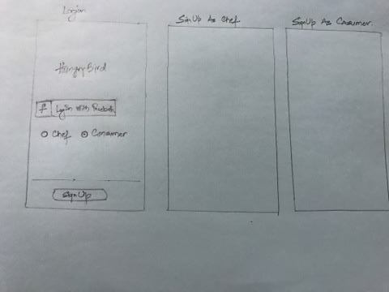
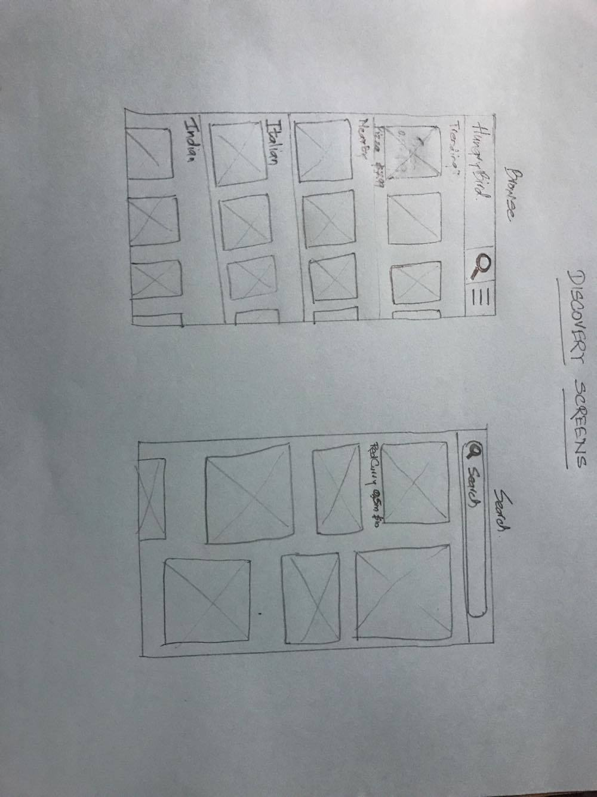
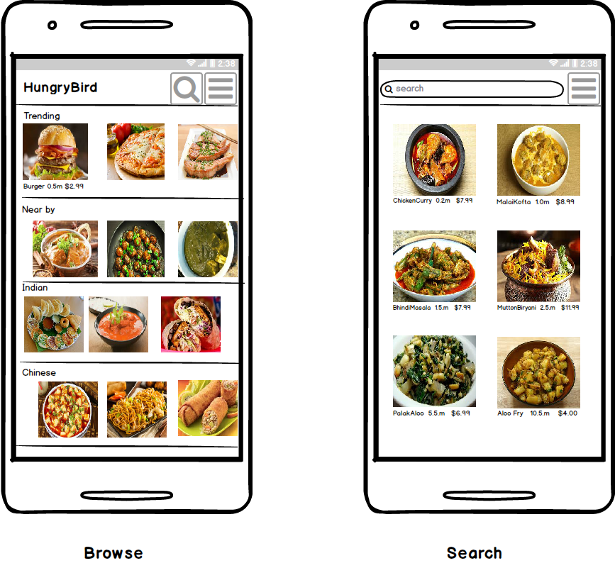
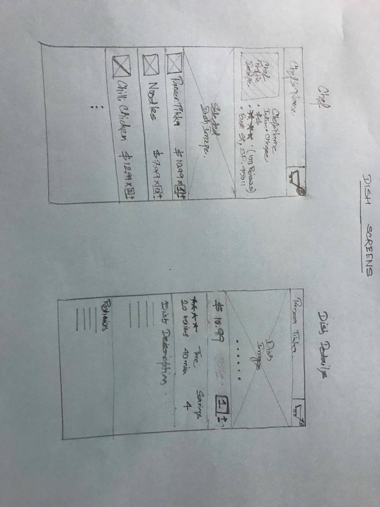
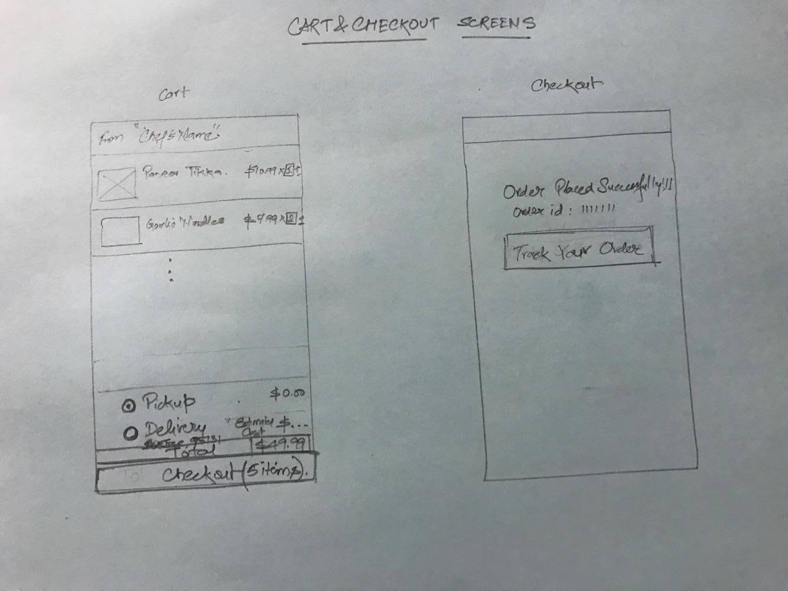

# Group Project - *HungryBird*

**HungryBird** is an android app that allows a user to discover dishes from nearby chefs and order them.

## User Stories

More detailed list: https://github.com/android-group-6/HungryBird/blob/master/UserStories/ProjectPlanning.pdf

**required**

- [ ] **Login/SignUp Screens**
  - [ ] SignUp using facebook as consumer or chef
  - [ ] Login using facebook as consumer or chef
- [ ] **Discovery Screens**
  - [ ] Consumer should be able to browse dishes which are trending, nearby, cuisine based etc.
  - [ ] Consumer should be able to search dishes.
- [ ] **Dish Screens**
  - [ ] Consumer should be able to view dishes offered by a chef.
  - [ ] Consumer should be able to add dishes to cart.
  - [ ] Consumer should be able to view details of a dish.
- [ ] **Cart/Checkout Screens**
  - [ ] Consumer should be able to view an order and update them.
  - [ ] Consumer should be able to checkout an order and specify pickup/delivery options.
  - [ ] Chef should receive a notification of an order.
- [ ] **Chef's Stories**
     **Chef should be able to**
  - [ ] see all the pending, In progres and done orders
  - [ ] Change status of each order and notify consumer for the relevant once
  - [ ] See all of the offering
  - [ ] Add Deleted and modify Dishes and Dish details 
 
**optional**
- [ ] **Profile Screen**
  - [ ] Youtube embedded video channels for the chef
  - [ ] Contact information using twilio
  - [ ] Reviews section for chef or dishes
- [ ] **Consumer Screen**
  - [ ] Favorite a chef

## Wireframes
- [ ] **Login/SignUp Screens**

- [ ] **Discovery Screens**

- [ ] **Dish Screens**

- [ ] **Cart/Checkout Screens**

- [ ] **Chef's Flow/Screens**

## Video Walkthrough

Here's a walkthrough of implemented user stories:

GIF created with [LiceCap](http://www.cockos.com/licecap/).

## Notes

Describe any challenges encountered while building the app.

## Open-source libraries used

- [Android Async HTTP](https://github.com/loopj/android-async-http) - Simple asynchronous HTTP requests with JSON parsing
- [Picasso](http://square.github.io/picasso/) - Image loading and caching library for Android

## License

    Copyright [2017] [Gaurav Bajaj, Dhwani Shah, Ankit Jasuja]

    Licensed under the Apache License, Version 2.0 (the "License");
    you may not use this file except in compliance with the License.
    You may obtain a copy of the License at

        http://www.apache.org/licenses/LICENSE-2.0

    Unless required by applicable law or agreed to in writing, software
    distributed under the License is distributed on an "AS IS" BASIS,
    WITHOUT WARRANTIES OR CONDITIONS OF ANY KIND, either express or implied.
    See the License for the specific language governing permissions and
    limitations under the License.
